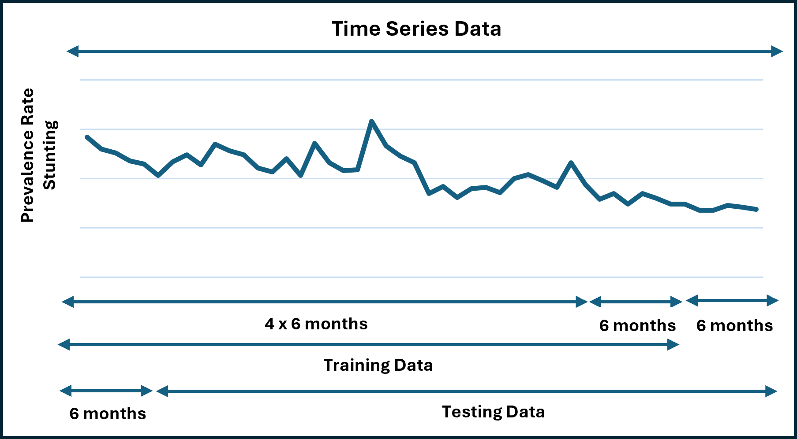

# Deep Learning (Pyhton) for Prediction of The Highest Prevelance Stunting
Deep Learning Programming Using Python for Prediction of The Highest Prevelance Stunting in East Java

# Introduction

Indonesia will experience a demographic bonus in 2030, where the productive age force will dominate the population and become an economic buffer. The demographic bonus that Indonesia will have is the productive age force (15-64 years) which is predicted to reach 68 percent of the total population and the old force (65 years and over) around 9 percent. However, that potential becomes useless if human resources are stunted. According to WHO (2015), stunting is a disorder of growth and development of children due to chronic malnutrition and repeated infections, which is characterized by their length or height being below the standard. Meanwhile, in 2020, WHO said that stunting is short or very short based on length or height according to age that is less than -2 standard deviations on the WHO growth curve that occur due to irreversible conditions due to inadequate nutritional intake and/or repeated or chronic infections that occur in the first 1000 days of life. Based on WHO data, a country is said to experience stunting problems if the number of cases is above 20%. According to the 2022 Indonesian Nutritional Status Survey (SSGI) Pocket Book, the prevalence of stunting in Indonesia decreased to 21.6% from 24.4% in 2021. In East Java province, stunting prevalence has also decreased from 23.5% in 2021 to 19.2% in 2022. However, the Deputy Governor of East Java, Emil Elestianto Dardak, said that he targeted a reduction in stunting prevalence in East Java to 13.5% by 2024. This target is lower than the central government's target of 14% in accordance with the 2020-2024 National Medium-Term Development Plan (RPJMN).
 
Based on the background of the problem and previous research that has been described, this study compares prevalence predictions regarding stunting cases using deep learning. This research is very important to be carried out, to produce predictions of the development of the prevalence of stunting cases in the future, which can be used as reference material for the East Java Provincial Health Office to realize the government's mission in reducing the prevalence of stunting cases and find out which methods can be used to make the best predictions with the highest level of accuracy.

# Deep Learning

According to https://www.ibm.com/topics/deep-learning 
 
Deep learning is a subset of machine learning that uses multi-layered neural networks, called deep neural networks, to simulate the complex decision-making power of the human brain. Some form of deep learning powers most of the artificial intelligence (AI) in our lives today.
 
By strict definition, a deep neural network, or DNN, is a neural network with three or more layers. In practice, most DNNs have many more layers. DNNs are trained on large amounts of data to identify and classify phenomena, recognize patterns and relationships, evaluate posssibilities, and make predictions and decisions. While a single-layer neural network can make useful, approximate predictions and decisions, the additional layers in a deep neural network help refine and optimize those outcomes for greater accuracy.
 
Deep learning drives many applications and services that improve automation, performing analytical and physical tasks without human intervention. It lies behind everyday products and services—e.g., digital assistants, voice-enabled TV remotes,  credit card fraud detection—as well as still emerging technologies such as self-driving cars and generative AI. 
 

# Reference

This research refers to a book written by Basuki Rahmat and Budi Nugroho entitled "Pemrograman Deep Learning Dengan Python" (Deep Learning Programming with Python). The book uses deep learning to predict the Open Unemployment Rate (Tingkat Pengangguran Terbuka - TPT) in Indonesia. Research can be seen at https://github.com/bsrahmat/dl
 

 

In the current research, the author will use deep learning to predict the highest prevalence of stunting in East Java

# Prediction of The Highest Prevelance Stunting
# Model Data Structure

The dataset used in this study is data obtained from the East Java Health Office. The data taken are data in 2020-2022. Of these data, some are used for the Training Phase and the rest
for the Prediction Testing Phase. Stunting Data used for the Training Phase
(Training Data), namely Stunting data from 2020 to 2021 for
predicting stunting from January 2022 to June 2022. While the stunting data used
for the Test Phase (Test Data), it only needs to be shifted in the next six months, namely data
Stunting from July 2020 to June 2022 to predict stunting from July 2022 to December 2022.
Thus, the need for this prediction system, designed to predict
Stunting in the next six months, based on stunting data from the previous two years.
If each stunting data is bi-annual throughout 2020 up to
2021 was grouped, then four groups were obtained for six months. In a way that
similarly, for the predicted six-month stunting data is used as a prediction group.
This design is then used as a system model, which is a system with four
input and one output. So that the structure of the Training Data and Testing Data models, is appropriate
This design is as shown in the following figure.
 

# Normalization

The data used for the Stunting prediction system is expressed in percent. The value ranges from 0 to 100. While the Deep Learning output is according to the activation function used. For example in the output node, using the Sigmoid activation function.
So according to the equation of the Sigmoid activation function, the output of this node, is a value between 0 to 1. Therefore, this stunting data needs to be normalized. In order to enter the range of Deep Learning capabilities. Later, if it will be compared with the actual desired stunting target or value, the predicted output results from Deep Learning must be denormalized first. For data normalization purposes, use the following equation.

